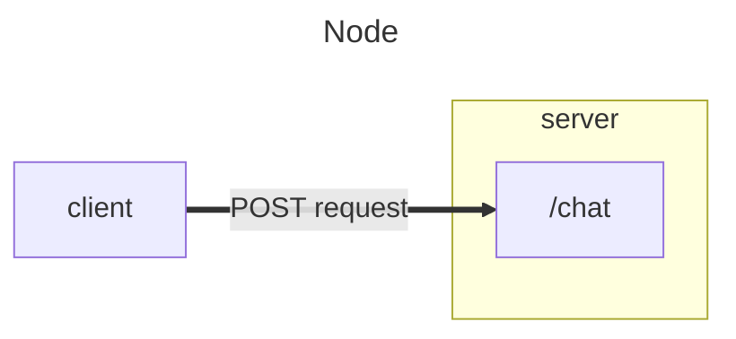

After authenticating, (which is covered here), a client makes a post request to /chat

```mermaid
---
title: Node
---


graph LR;

    subgraph server
    /chat
    end
    
    client == POST request ==> /chat;
```