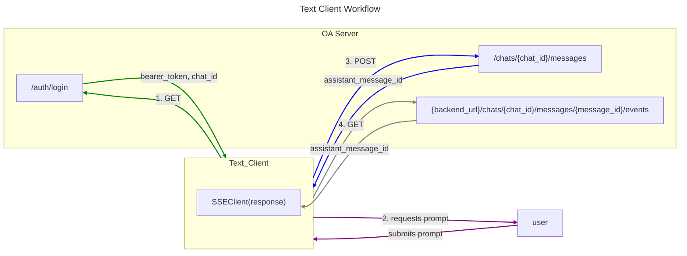

# Inference

### From the perspective of the Text Client

For development, a basic REPL client is used as a chat interface, built around [Typer](https://typer.tiangolo.com/).

The client authenticates with the backend open assistant server, which provides a chat id for the client.

The client then collects the user prompt. 

the client posts to the endpoint /chats/{chat_id}/messages
included in this request is the message content and a parent_id (assistant's response to prior message)

in the response, the server will return an assistant_message id. 

The client will use this id to make a GET request to 
{backend_url}/chats/{chat_id}/messages/{message_id}/events
critically, in this GET request the client passes stream=True in the body and "Accept": "text/event-stream" in the headers.

The response is then used to instantiate and SSEClient, which - via its events() method,
returns an iterable that can be used to print out inference results, one token at a time.

After exhausting the events iterable (ie inference is complete), the 

### From the perspective of the OA Inference Server